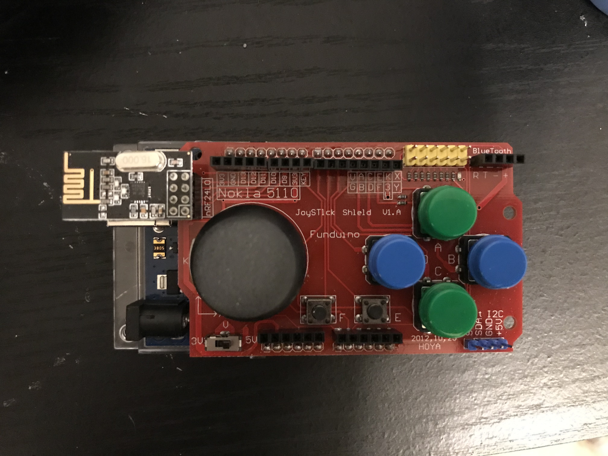
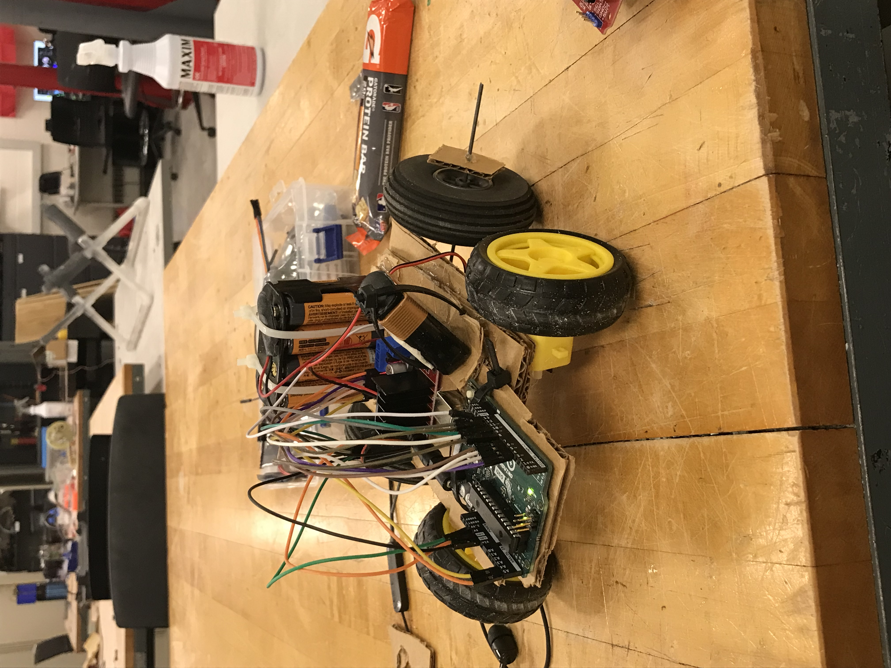

# RC Car 
## Items
- [Joystick Arduino Shield](https://www.amazon.com/HiLetgo-Joystick-Expansion-Keyboard-Function/dp/B08KZVS4GZ/ref=sr_1_1_sspa?crid=3J5QSP7HKP6J8&keywords=joystick+shield&qid=1682826579&s=electronics&sprefix=joystick+shield+%2Celectronics%2C145&sr=1-1-spons&psc=1&spLa=ZW5jcnlwdGVkUXVhbGlmaWVyPUExOFkxMEZTNFk5MjJaJmVuY3J5cHRlZElkPUEwMjU1OTQ5M0RTRzlGU0hKQTZIOSZlbmNyeXB0ZWRBZElkPUEwMjM1MzQyMzdOR0FDUFE1NzVaNiZ3aWRnZXROYW1lPXNwX2F0ZiZhY3Rpb249Y2xpY2tSZWRpcmVjdCZkb05vdExvZ0NsaWNrPXRydWU=)
- [L298N](https://www.amazon.com/AEDIKO-Motor-Gearbox-200RPM-Ratio/dp/B09N6NXP4H/ref=sr_1_18?keywords=dc+motors&qid=1682826709&sr=8-18)
- 2x [NRF24L01](https://www.amazon.com/HiLetgo-NRF24L01-Wireless-Transceiver-Module/dp/B00LX47OCY/ref=sr_1_1_sspa?crid=1H2NDU1F2658P&keywords=nrf24l01&qid=1682826766&sprefix=nrf%2Caps%2C125&sr=8-1-spons&psc=1&spLa=ZW5jcnlwdGVkUXVhbGlmaWVyPUFYSkxXRDZYT01UQkMmZW5jcnlwdGVkSWQ9QTAzNzM4NDIyMExORE1JUkRGODFWJmVuY3J5cHRlZEFkSWQ9QTAxNzQ0NjMxMkoxU0g5TzFGVzVZJndpZGdldE5hbWU9c3BfYXRmJmFjdGlvbj1jbGlja1JlZGlyZWN0JmRvTm90TG9nQ2xpY2s9dHJ1ZQ==)
- [12V Battery Case](https://www.amazon.com/SDTC-Tech-Battery-Connector-Thicken/dp/B08592H6CH/ref=sr_1_3?crid=3LVVF20B4OM75&keywords=12v+battery+supply+arduino&qid=1682826828&sprefix=12v+battery+supplyrduino%2Caps%2C209&sr=8-3)

- Link to [RC Car Demo](https://youtu.be/aG-M_SQyptw)
## Pin Assignments
All Pin Assignments are in an excel sheet in the controller and RC_Car folders.
## How To Control
Using the joystick on the shield, it will move the RC car forward, back, left, and right. Using the right button on the pad will stop the car in general.
## Controller Module
Using the Joystick library, All of the buttons have a callback function when a they are pressed or when the joystick is moved. In these callback functions an intenger is sent through the NRF transciever. This is done without acknowledgment that the RC car has received the packet.

## RC Car
When the RC car receives the payload, it will interpret this payload into an action the RC Car has to execute. The 5 functions the RC Car can execute is go forward, backward, left, right, and stop. 

Each one is executed by the joystick except stop, this is executed by the right button on the module. The L298N module is used to drive these dc motor and the pins on the arduino are used to control this module. 
## Body Design
The body design of the RC Car is build by a cardboard body. The project being back heavy, due to the battery pack being on the back of the car it leads to the front tires not have enough weight to weigh it down. 

    Sometimes the tires may not be able grip the ground and the car may have trouble turning, but with some minor adjustments the design can be improved upon. This is not the only design these components can used with. 

